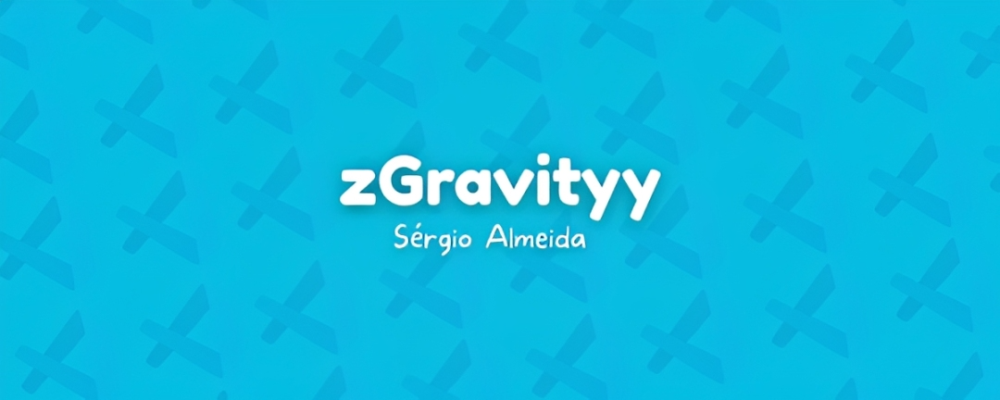
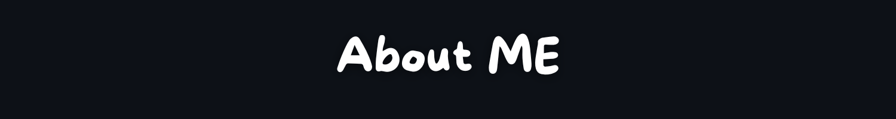
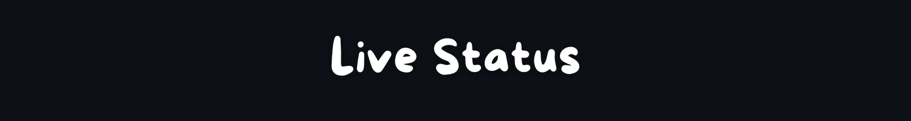
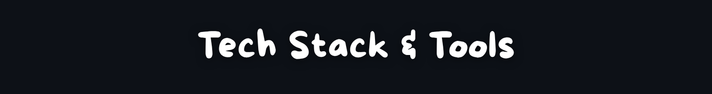
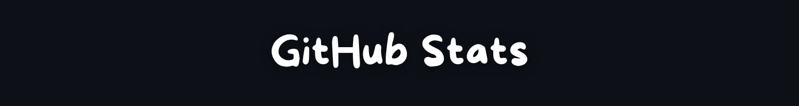
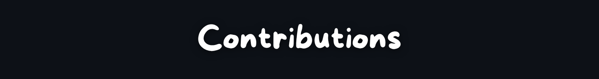
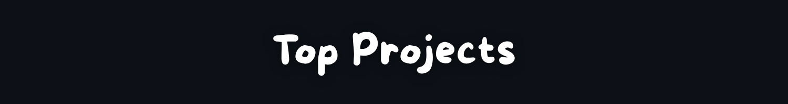
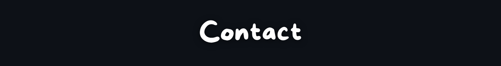

  

  

  

 

  

 

<table align="center" width="90%" border="0" cellpadding="20">
  <tr>
    <td width="65%" style="font-size: 18px; padding: 40px 20px;">
      <ul style="line-height: 1.8;">
        <li><b>Building:</b> Projects and systems at <a href="https://zenstudios.online">Zen Studios</a></li>
        <li><b>Focus:</b> Front-End & Modern Web Interfaces</li>
        <li><b>Technical Base:</b> Strengthening Back-End fundamentals (Python/APIs)</li>
        <li><b>Ask me about:</b> Design Systems and Server Management</li>
        <li><b>Portfolio:</b> <a href="https://guns.lol/zgravityy">guns.lol/zgravityy</a></li>
      </ul>
    </td>
    <td width="35%" align="center" style="padding: 20px;">
      
    </td>
  </tr>
</table>

 

  

  

 

  

  

 

  

  
  

  

 

  

  <picture>
    <source media="(prefers-color-scheme: dark)" srcset="https://raw.githubusercontent.com/zGravity123/zGravity123/output/github-contribution-grid-snake-dark.svg">
    <source media="(prefers-color-scheme: light)" srcset="https://raw.githubusercontent.com/zGravity123/zGravity123/output/github-contribution-grid-snake.svg">
    
  </picture>

 

  

  
  

  
  

 

  

  
  

